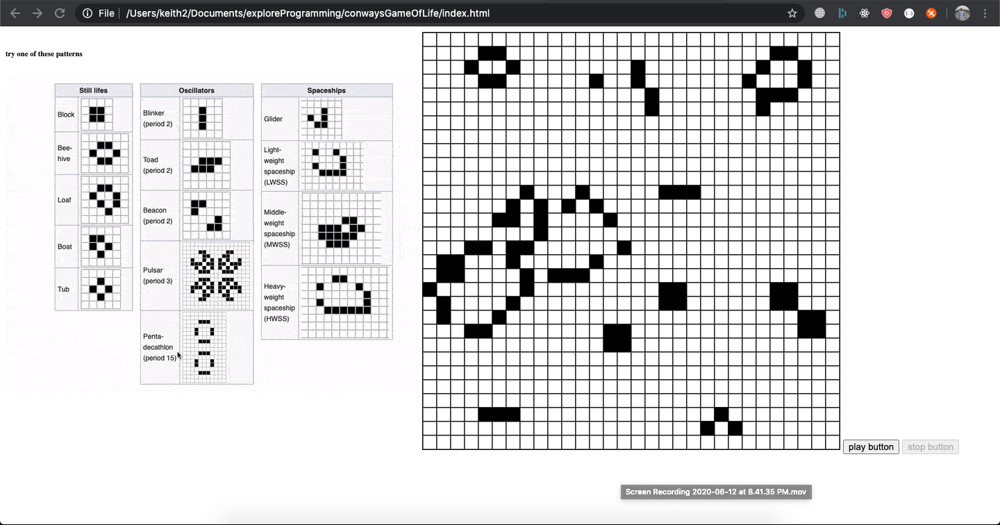

# Conway's Game of life.
## Overview:
The intent behind writing this piece os code was to write the entire game from scratch. This was a development to only bring forward the functionality hence the UI is very rudimentary.

Live: [demo](https://keith3895.github.io/conways-game-of-life/index.html)
## Rules of the game:

The rules of the game are explained clearly in it's [Wikipedia entry](http://en.wikipedia.org/wiki/Conway%27s_Game_of_Life). The relevant portion is quoted here:

> The universe of the Game of Life is an infinite two-dimensional orthogonal grid
> of square cells, each of which is in one of two possible states, alive or dead.
> Every cell interacts with its eight neighbors, which are the cells that are
> horizontally, vertically, or diagonally adjacent. **At each step in time, the
> following transitions occur:**
> 
> 1. Any live cell with fewer than two live neighbors dies, as if caused by under-population.
> 2. Any live cell with two or three live neighbors lives on to the next generation.
> 3. Any live cell with more than three live neighbors dies, as if by overcrowding.
> 4. Any dead cell with exactly three live neighbors becomes a live cell, as if by reproduction.

> The initial pattern constitutes the seed of the system. The first generation is
> created by applying the above rules simultaneously to every cell in the
> seed—births and deaths occur simultaneously, and the discrete moment at which
> this happens is sometimes called a tick (in other words, each generation is a
> pure function of the preceding one). The rules continue to be applied repeatedly
> to create further generations.

## Usage:
Just opening the html([index.html](./index.html)) in the browser should do. 

the hosted demo is on git pages for this repo.
[demo](https://keith3895.github.io/conways-game-of-life/index.html)
